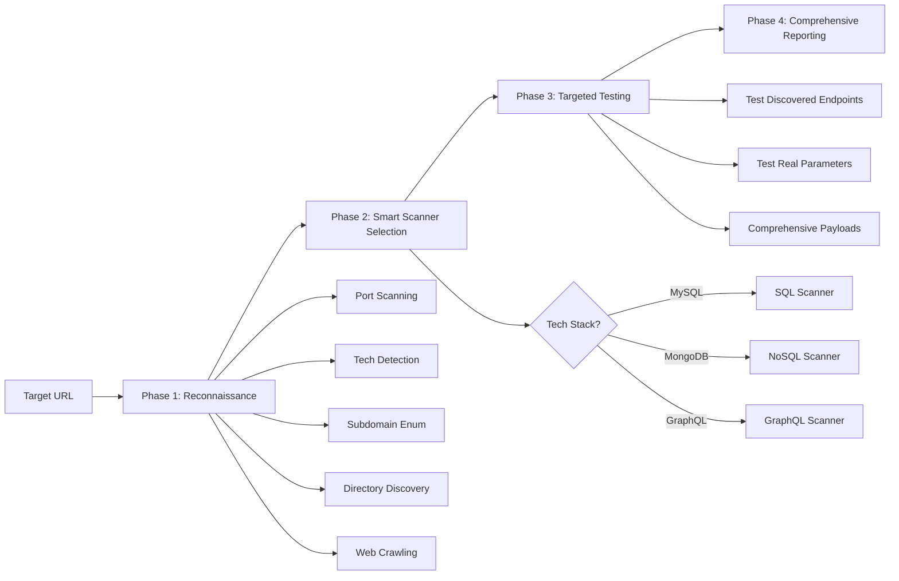

<div align="center">

# 🛡️ Cerberus API Sentinel

### Professional-Grade API Security Scanner with Nikto-Level Vulnerability Detection

[](https://github.com/CerberusMrX/Cerberus-API-Sentinel/stargazers)
[](https://github.com/CerberusMrX/Cerberus-API-Sentinel/network/members)
[](LICENSE)
[](https://www.python.org/downloads/)
[](CONTRIBUTING.md)

[Features](#-features) • [Installation](#-installation) • [Usage](#-usage) • [Screenshots](#-screenshots) • [Documentation](#-documentation)


*Professional reconnaissance-first penetration testing methodology*

</div>

---

## 📋 Table of Contents

- [Overview](#-overview)
- [Key Features](#-key-features)
- [Professional Scan Methodology](#-professional-scan-methodology)
- [Installation](#-installation)
- [Quick Start](#-quick-start)
- [Usage Examples](#-usage-examples)
- [Screenshots](#-screenshots)
- [Architecture](#-architecture)
- [Technology Stack](#-technology-stack)
- [Contributing](#-contributing)
- [Security Disclaimer](#-security-disclaimer)
- [License](#-license)
- [Author](#-author)

---

## 🔍 Overview

**Cerberus API Sentinel** is an enterprise-grade API security testing framework that follows professional penetration testing methodology. Built with a **reconnaissance-first approach**, it comprehensively maps the attack surface before executing targeted vulnerability scans.

Unlike traditional scanners that blindly test endpoints, Cerberus intelligently:
- 🔎 **Discovers** the complete attack surface (ports, subdomains, directories, tech stack)
- 🎯 **Selects** scanners based on discovered technologies
- 🚀 **Executes** Nikto-level comprehensive payload testing
- 📊 **Reports** findings with detailed POCs and remediation advice

### Why Cerberus?

- ✅ **Professional Methodology**: Follows industry-standard reconnaissance → testing → reporting workflow
- ✅ **Comprehensive Coverage**: 23 vulnerability scanners covering OWASP API Top 10 and beyond
- ✅ **Nikto-Level Payloads**: 200+ SQL injection, 150+ XSS, 75+ SSRF payloads
- ✅ **Smart Detection**: Automatically selects relevant scanners based on tech stack
- ✅ **Dual Interface**: Modern web UI and powerful CLI for automation
- ✅ **Real-Time Updates**: Live reconnaissance stats and scan progress via WebSockets
- ✅ **Parallel Execution**: 20-30 parallel workers for rapid reconnaissance

---

## ✨ Key Features

### 🎯 Reconnaissance Phase (Professional Attack Surface Mapping)
<table>
<tr>
<td width="50%">

**🔌 Port Scanning**
- 20 parallel workers
- Identifies open services
- Discovers hidden endpoints

**🔍 Technology Detection**
- Server fingerprinting
- Framework identification
- Database inference
- Frontend detection

</td>
<td width="50%">

**🌐 Subdomain Enumeration**
- 30 parallel DNS queries
- 50+ common patterns
- Real-time discovery

**📂 Directory Discovery**
- 80+ common paths
- Admin panels
- API endpoints
- Sensitive files

</td>
</tr>
</table>

### 🛡️ Vulnerability Scanning (23 Professional Scanners)

<details>
<summary><b>🔴 Injection Attacks</b></summary>

- **SQL Injection** ⭐ *Nikto-Level: 200+ payloads*
  - Union-based, Time-based, Boolean-based, Error-based
  - All databases: MySQL, PostgreSQL, MSSQL, Oracle, SQLite
  - WAF bypass techniques, encoding tricks
  
- **NoSQL Injection** - MongoDB, Redis, Cassandra, CouchDB
- **Command Injection** - OS command execution
- **LDAP Injection** - Directory service attacks
- **XPath Injection** - XML query manipulation
- **XML Injection** - External entity attacks

</details>

<details>
<summary><b>🟠 Cross-Site Scripting (XSS)</b></summary>

⭐ **Nikto-Level: 150+ payloads**
- Reflected, Stored, DOM-based XSS
- Framework-specific (Angular, React, Vue)
- Filter evasion, Mutation XSS
- Context-aware testing

</details>

<details>
<summary><b>🟡 Server-Side Attacks</b></summary>

- **SSRF** ⭐ *Nikto-Level: 75+ payloads* - Cloud metadata, internal network
- **SSTI** - Template injection (Jinja2, Twig, Freemarker)
- **XXE** - XML External Entity attacks

</details>

<details>
<summary><b>🟢 Authentication & Authorization</b></summary>

- **Broken Authentication** - Weak credentials, session management
- **BOLA/IDOR** - Object-level authorization flaws
- **Broken Access Control** - Privilege escalation
- **JWT Vulnerabilities** - Token manipulation, signature bypass
- **OAuth Misconfigurations** - Redirect URI attacks

</details>

<details>
<summary><b>🔵 API-Specific Vulnerabilities</b></summary>

- **GraphQL Injection** - Query depth, introspection, batching
- **HTTP Parameter Pollution** - HPP attacks
- **Mass Assignment** - Object property injection
- **Rate Limiting Issues** - Brute force protection bypass

</details>

<details>
<summary><b>🟣 Security Misconfigurations</b></summary>

- **Security Headers** - Missing CSP, HSTS, X-Frame-Options
- **Sensitive Data Exposure** - PII leakage, emails, API keys
- **Business Logic Flaws** - Payment bypass, workflow manipulation
- **Insufficient Logging** - Missing audit trails

</details>

---

## 🔄 Professional Scan Methodology



### Scan Flow Breakdown

| Phase | Progress | Duration | Activities |
|-------|----------|----------|------------|
| **🔍 Reconnaissance** | 5-30% | 30-60s | Port scan → Tech detection → Subdomain enum → Directory discovery → Crawling |
| **🎯 Smart Selection** | 30-35% | 5s | Analyze tech stack → Select relevant scanners → Skip irrelevant tests |
| **🛡️ Vulnerability Testing** | 35-85% | 1-3 min | Run selected scanners → Test discovered endpoints → Comprehensive payloads |
| **📊 Reporting** | 85-100% | 10s | Compile results → Generate POCs → Create reports |

---

## 🚀 Installation

### Prerequisites
- **Python** 3.8 or higher
- **Node.js** 16+ and npm
- **Git**

### Clone Repository
```bash
git clone https://github.com/CerberusMrX/Cerberus-API-Sentinel.git
cd Cerberus-API-Sentinel
```

### Backend Setup
```bash
# Create virtual environment
python3 -m venv venv
source venv/bin/activate  # Linux/Mac
# venv\Scripts\activate   # Windows

# Install dependencies
pip install -r requirements.txt

# Setup database
cd web/backend
python manage.py migrate
cd ../..
```

### Frontend Setup
```bash
cd web/frontend
npm install
cd ../..
```

---

## ⚡ Quick Start

### Option 1: Web Interface 🖥️

**Terminal 1 - Start Backend:**
```bash
cd web/backend
source ../../venv/bin/activate
./start_server.sh
```

**Terminal 2 - Start Frontend:**
```bash
cd web/frontend
npm run dev
```

**Access:** http://localhost:5173

### Option 2: CLI Interface 💻

**Full Scan (All 23 Scanners):**
```bash
source venv/bin/activate
python -m cli.main -u https://api.target.com --scan-all
```

**Targeted Scan (Specific Scanners):**
```bash
python -m cli.main -u https://api.target.com \
  --scan-sqli \
  --scan-xss \
  --scan-ssrf
```

**With Authentication:**
```bash
python -m cli.main -u https://api.target.com \
  --auth-type bearer \
  --auth-token "eyJhbGciOiJIUzI1NiIs..." \
  --scan-all
```

**Generate Reports:**
```bash
python -m cli.main -u https://api.target.com \
  --scan-all \
  --report-json report.json \
  --report-html report.html
```

---

## 📸 Screenshots

### Web Application Interface

#### 1. Dashboard Overview


*Project dashboard with real-time scan status*

#### 2. Reconnaissance Phase - Live Discovery


*Real-time attack surface mapping: ports, subdomains, directories, technologies*

#### 3. Vulnerability Scanning - Payload Testing


*Live payload execution with WebSocket updates*

#### 4. Scan Results


*Comprehensive vulnerability report with severity ratings*

### CLI Interface

#### 5. Terminal Scan Execution


*Command-line professional scan with real-time output*

#### 6. Vulnerability Report


*Terminal-based vulnerability findings with color-coded severity*

---

## 🏗️ Architecture

```
cerberus-sentinel/
├── engine/                    # Core Scanning Engine
│   ├── core/                 # Reconnaissance Modules
│   │   ├── port_scanner.py  # Parallel port scanning
│   │   ├── tech_detector.py # Framework fingerprinting
│   │   ├── subdomain_enum.py # DNS-based enumeration
│   │   ├── dir_discovery.py # Directory brute-forcing
│   │   ├── crawler.py       # Web crawling
│   │   ├── target.py        # Target abstraction
│   │   └── auth.py          # Authentication handlers
│   │
│   ├── scanners/            # 23 Vulnerability Scanners
│   │   ├── injection.py     # SQL Injection (200+ payloads)
│   │   ├── xss.py          # XSS (150+ payloads)
│   │   ├── ssrf.py         # SSRF (75+ payloads)
│   │   ├── nosql.py        # NoSQL Injection
│   │   ├── graphql.py      # GraphQL vulnerabilities
│   │   ├── jwt.py          # JWT attacks
│   │   └── ... (17 more)
│   │
│   └── reporting/           # Report Generators
│       ├── reporter.py     # JSON/HTML generation
│       └── templates/      # Report templates
│
├── cli/                     # Terminal Interface
│   └── main.py            # CLI entry point
│
├── web/                     # Web Application
│   ├── backend/            # Django REST + WebSockets
│   │   ├── projects/      # Project management
│   │   ├── scans/         # Scan orchestration
│   │   └── config/        # Django configuration
│   │
│   └── frontend/           # React Application
│       ├── src/
│       │   ├── components/
│       │   │   └── ScanProgress.jsx  # Real-time dashboard
│       │   └── pages/
│       │       ├── Projects.jsx
│       │       └── Reports.jsx
│       └── package.json
│
├── requirements.txt        # Python dependencies
└── README.md              # This file
```

---

## 🛠️ Technology Stack

### Backend
- **Python 3.8+** - Core language
- **Django 5.0** - Web framework
- **Django REST Framework** - API endpoints
- **Daphne** - ASGI server for WebSockets
- **Channels** - WebSocket support
- **Requests** - HTTP client
- **BeautifulSoup4** - HTML parsing

### Frontend
- **React 18** - UI framework
- **Vite** - Build tool
- **TailwindCSS** - Styling
- **Lucide React** - Icons
- **Axios** - HTTP client

### Reconnaissance
- **Socket** - Port scanning
- **DNS queries** - Subdomain enumeration
- **Parallel workers** - ThreadPoolExecutor

---

## 📚 Usage Examples

### Example 1: Full Professional Scan

```python
# Professional reconnaissance-first scan
python -m cli.main -u https://api.production.com --scan-all

# Output:
# Phase 1: Port Scanning... Found 3 open ports
# Phase 2: Technology Detection... Detected: Nginx, Node.js, MongoDB
# Phase 3: Subdomain Enumeration... Found 8 subdomains
# Phase 4: Directory Discovery... Found 23 paths
# Phase 5: Web Crawling... Crawled 45 URLs
#
# Attack Surface: 3 ports, 8 subdomains, 23 paths, 45 URLs
#
# Running NoSQLInjectionScanner (MongoDB detected)...
# Running XSSScanner...
# Running SSRFScanner...
# [12 scanners selected based on tech stack]
```

### Example 2: Targeted API Testing

```python
# Test specific vulnerabilities with authentication
python -m cli.main \
  -u https://api.staging.com/v2 \
  --auth-type bearer \
  --auth-token "eyJhbGc..." \
  --scan-sqli \
  --scan-nosql \
  --scan-graphql \
  --report-html api_security_report.html
```

### Example 3: Automation & CI/CD Integration

```bash
#!/bin/bash
# Automated security scan in CI/CD pipeline

python -m cli.main \
  -u $TARGET_URL \
  --scan-all \
  --report-json scan_results.json

# Parse results
CRITICAL=$(jq '.vulnerabilities[] | select(.severity=="CRITICAL")' scan_results.json | wc -l)

if [ $CRITICAL -gt 0 ]; then
  echo "❌ Found $CRITICAL critical vulnerabilities. Failing build."
  exit 1
fi
```

---

## 🔒 Security Disclaimer

### ⚠️ **IMPORTANT: Legal and Ethical Use Only**

This tool is designed for **authorized security testing only**. You must:

✅ **DO:**
- Test systems you own
- Obtain explicit written permission before testing
- Follow responsible disclosure practices
- Comply with all applicable laws and regulations
- Use in controlled test environments

❌ **DON'T:**
- Scan systems without permission
- Use for malicious purposes
- Test production systems without approval
- Violate computer fraud laws
- Ignore scope limitations

**Legal Notice**: Unauthorized access to computer systems is illegal. The authors and contributors are not responsible for misuse of this tool. By using Cerberus API Sentinel, you agree to use it ethically and legally.

---

## 🤝 Contributing

Contributions are welcome! Please see [CONTRIBUTING.md](CONTRIBUTING.md) for guidelines.

### How to Contribute

1. Fork the repository
2. Create a feature branch (`git checkout -b feature/AmazingFeature`)
3. Commit your changes (`git commit -m 'Add AmazingFeature'`)
4. Push to the branch (`git push origin feature/AmazingFeature`)
5. Open a Pull Request

### Development Setup

```bash
# Install development dependencies
pip install -r requirements-dev.txt

# Run tests
pytest

# Code formatting
black .
flake8 .
```

---

## 📄 License

This project is licensed under the **MIT License** - see the [LICENSE](LICENSE) file for details.

---

## 👨‍💻 Author

**Sudeepa Wanigarathna**

- GitHub: [@CerberusMrX](https://github.com/CerberusMrX)
- LinkedIn: [Your LinkedIn]
- Website: [Your Website]

---

## 🙏 Acknowledgments

- OWASP for comprehensive vulnerability classification
- Security research community for payload techniques
- Open-source contributors

---

## 📊 Project Stats


---

<div align="center">

### ⭐ Star this repository if you find it useful!

**Built with ❤️ for the security community**

[Report Bug](https://github.com/CerberusMrX/Cerberus-API-Sentinel/issues) • [Request Feature](https://github.com/CerberusMrX/Cerberus-API-Sentinel/issues) • [Documentation](https://github.com/CerberusMrX/Cerberus-API-Sentinel/wiki)

</div>
